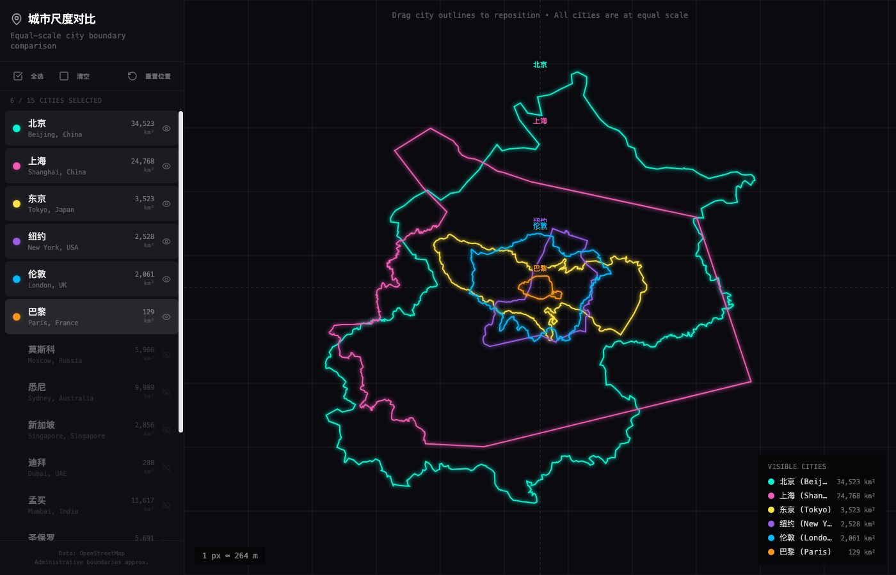

# City Scale Compare · 城市尺度对比

Overlap the urban footprints of **79 world cities** at the same geographic scale — boundary polygons and full street networks — to make cross-city size comparisons that satellite views and Wikipedia infoboxes can't.



## Why this exists

Stand-alone city maps lie about size. A render of Tokyo at "good detail" and a render of Singapore at "good detail" are usually drawn at completely different scales — your eye reads them as comparable when they aren't. This tool draws every city at the **same km-per-pixel** so the comparison is honest.

The boundary isn't an administrative line, either. Political boundaries are useless for this kind of comparison (Tokyo Metropolis is 2,194 km² vs. NYC's 783 km², which makes Tokyo look smaller than its actual built-up footprint). Instead this project uses **Natural Earth's night-lights urban polygons** — the actual lit-up built environment — and **OpenStreetMap road networks** within each polygon's bounding box.

## Live cities (79 total)

Grouped into **6 regions** in the sidebar:

| Region | Count | Notable |
|---|---|---|
| China (中国) | 16 | Beijing, Shanghai, Shenzhen, Hong Kong, Chongqing, Tianjin … |
| APAC (亚太, incl. Oceania) | 18 | Tokyo, Seoul, Mumbai, Jakarta, Delhi, Sydney, Auckland … |
| Europe (欧洲) | 15 | London, Paris, Moscow, Istanbul, Berlin, Madrid, Rome … |
| North America (北美) | 12 | New York, LA, Chicago, Mexico City, Toronto, Houston … |
| South America (南美) | 9 | São Paulo, Buenos Aires, Rio, Lima, Santiago … |
| Africa (非洲) | 9 | Cairo, Lagos, Johannesburg, Nairobi, Cape Town … |

## Stack

- **Frontend** — React 19 + TypeScript + Vite + Tailwind CSS, with shadcn/ui primitives.
- **Rendering** — a single **HTML Canvas 2D**. Geometry is projected once per zoom and cached as `Path2D` (a drag never re-projects), roads are decimated to the current zoom (LOD) and built one city per animation frame. A metro's road network is up to ~1.1M vertices — SVG/DOM can't hold that; the canvas draws it in ~0.2 ms/frame.
- **Data** — Natural Earth `ne_10m_urban_areas` for boundaries, Overpass API (OSM) for roads.

## Quick start

```bash
pnpm install
pnpm dev              # dev server with HMR
# → http://localhost:5173
```

The app reads `public/data/cities.json` once at startup, then **lazy-loads each city's road file only when you toggle it visible** — so opening the sidebar with 79 cities is instant; only what you select is downloaded.

Per-city road JSONs (~250 MB total) are hosted in the sibling repo [`city-scale-comparison-data`](https://github.com/RinshannKaihou/city-scale-comparison-data) and served via GitHub Pages. The default `.env` points there; override with `.env.local` or `VITE_ROADS_BASE_URL` to fetch from somewhere else. See [`docs/DATA-HOSTING.md`](docs/DATA-HOSTING.md).

Optional — for fully offline dev, populate `public/data/roads-stitched/` locally:

```bash
pnpm fetch-data       # downloads all 79 road JSONs to public/data/
```

Other scripts:

```bash
pnpm build            # production build (tsc -b && vite build) → dist/
pnpm preview          # serve dist/ locally
pnpm typecheck        # TypeScript only
pnpm lint             # ESLint
```

## Using the app

1. **Toggle cities** in the sidebar's regional accordions (China + Asia auto-expanded by default).
2. **Drag** any city overlay to align landmarks for easier comparison. Hit "重置位置" to reset.
3. **Region tri-state checkbox** on each accordion header bulk-toggles every city in that region.
4. A **soft warning** appears if you select more than 12 cities at once — the visualization stays readable up to ~10–12 overlapping cities. The warning doesn't block; just suggests.

## Data pipeline

Three stages, all idempotent. Run in order from the project root:

```bash
node scripts/extract-urban-areas.js    # Natural Earth → public/data/cities.json
node scripts/fetch-roads-overpass.js   # Overpass    → public/data/roads/<id>.json
node scripts/stitch-roads.js           # roads/      → public/data/roads-stitched/<id>.json
```

What each does:

- **extract-urban-areas** — matches each city seed to a consistent built-up footprint. Every Natural Earth polygon is attributed to its **nearest seed**; a city grows from its home polygon by **adjacency flood-fill** across small gaps (≤ 8 km edge-to-edge, up to 45 km from the seed), so it reunites water-split fragments (NYC's harbour, Sydney's, Hong Kong's islands) without swallowing a neighbouring metro. Blobs that contain more than one seeded city (Pearl River Delta, Keihanshin, the Randstad…) are split along the **perpendicular bisectors** between their seeds; neighbouring cities not in the display list are added as hidden `display: false` shadow seeds to make that split happen. No fixed radius, no manual crop rectangles.
- **fetch-roads-overpass** — bbox-scoped Overpass queries for `motorway/trunk/primary/secondary/tertiary`. Three-mirror rotation, exponential backoff. **Auto-tiles** any bbox > 8,000 km² (Tokyo's 44k km² Kanto blob splits into a 3×3 grid). Skip-if-exists makes the script resumable across rate-limit interruptions. Supports `--region=<id>` for phased fetching.
- **stitch-roads** — angle-based stroke stitcher. OSM ways are fragmented at every intersection; this merges adjacent ways along straight continuations (≤30° turn) so roads look like roads in the render, not like ladder rungs. ~25–35% polyline-count reduction on average.

### Adding a city

1. Append a seed to the `cities` array in [`scripts/extract-urban-areas.js`](scripts/extract-urban-areas.js):
   ```js
   { id: 'kyoto', name: 'Kyoto', nameZh: '京都', country: 'Japan',
     region: 'asia', lat: 35.0116, lon: 135.7681 },
   ```
   Required fields: `id`, `name`, `nameZh`, `country`, `region`, `lat`, `lon`. Region must be one of `china | asia | europe | north-america | south-america | africa`.

2. Run the pipeline. Skip-if-exists means only the new city actually fetches:
   ```bash
   node scripts/extract-urban-areas.js
   node scripts/fetch-roads-overpass.js
   node scripts/stitch-roads.js
   ```

3. If the extractor reports the city as `✗ ... UNMATCHED`, your seed lat/lon isn't inside (or within ~5 km of) any Natural Earth polygon. Either move the seed closer to the urban core or check the metro really has a Natural Earth night-lights footprint (some smaller cities don't).

## Layout

```
src/
  components/
    CitySelector.tsx        # sidebar: region accordions + warning banner
    RegionAccordion.tsx     # one collapsible region group
    MapCanvas.tsx           # <canvas> + rAF paint, road-build pump, drag hit-testing, chrome
  lib/
    map-render.ts           # projection, LOD, Path2D cache, drawScene, hitTest (off React render)
    export-map.ts           # PNG (2× re-render) + SVG (rebuilt d-strings) export
    regions.ts              # REGION_ORDER + bilingual labels
    colors.ts               # per-city color palette
  hooks/
    useCityData.ts          # loads cities.json, lazy-fetches roads, owns visibility
  types/city.ts             # CityData / CityViewModel / CityGeometry
scripts/
  extract-urban-areas.js    # seeds + Natural Earth → cities.json (nearest-seed flood-fill + bisector partition)
  fetch-roads-overpass.js   # Overpass scraping
  stitch-roads.js           # ways → continuous polylines
public/data/
  cities.json               # 79 cities, geometry + metadata (~1.4 MB)
  # roads/ and roads-stitched/ are gitignored — pipeline outputs.
  # Stitched roads are hosted in the sibling repo (city-scale-comparison-data)
  # and served via GitHub Pages.
```

## Non-obvious conventions

A few things that look like bugs but aren't:

- **`bbox` is `[minLat, maxLat, minLon, maxLon]`** — not the GeoJSON `[W, S, E, N]` convention. Everything in this repo uses this order; don't swap.
- **Geometry is `Polygon | MultiPolygon`.** Cities split by water (NYC, Hong Kong) come out as MultiPolygon; single-piece cities as Polygon. Consumers must handle both.
- **`areaKm2` is the area of the drawn polygon**, not an external "official" city size — it's recomputed (equirectangular planar area) from the final matched-and-partitioned geometry. Intentional: linear dimensions track √areaKm2, which is what makes the equal-scale comparison meaningful.
- **`MAX_TILE_KM2 = 8000`** in the fetcher. Originally 12,000; lowered after Overpass started returning truncated JSON for ~10k km² single-tile queries. Most large metros now split 2×2 or 3×3.
- **Stitcher quantization is 1 cm** (`QUANT = 1e7`). OSM node coordinates match exactly at shared endpoints — there's no tolerance fallback. If neighboring cities' ways don't stitch, the upstream fetch missed the connecting way, usually at a bbox boundary.

## Repository size

The app repo is **~20 MB total** — `cities.json` (1.4 MB) ships in `public/data/`, but the 250 MB of per-city road JSONs live in the [`city-scale-comparison-data`](https://github.com/RinshannKaihou/city-scale-comparison-data) sibling repo and are fetched at runtime. Git history was rewritten on 2026-05-23 to strip the road data from all commits (force-push); a safety tag `pre-filter-repo-backup` on origin preserves the pre-rewrite state for ~30 days.

See [`docs/DATA-HOSTING.md`](docs/DATA-HOSTING.md) for how to bump the data version, swap CDNs, or run offline.

## Credits

- **Boundaries** — [Natural Earth](https://www.naturalearthdata.com/) `ne_10m_urban_areas` (public domain).
- **Roads** — © OpenStreetMap contributors, queried via [Overpass API](https://overpass-api.de/) (ODbL).
- **UI primitives** — [shadcn/ui](https://ui.shadcn.com/) (MIT).
